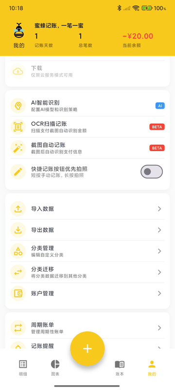
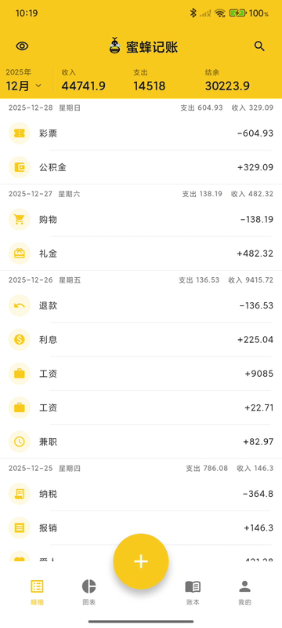
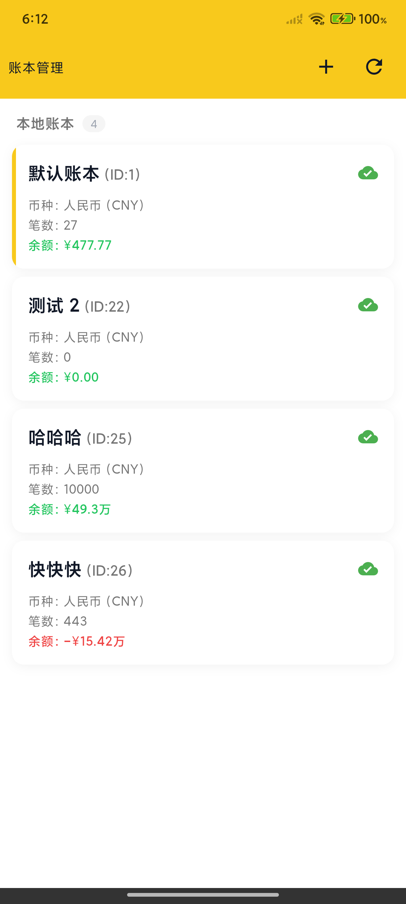
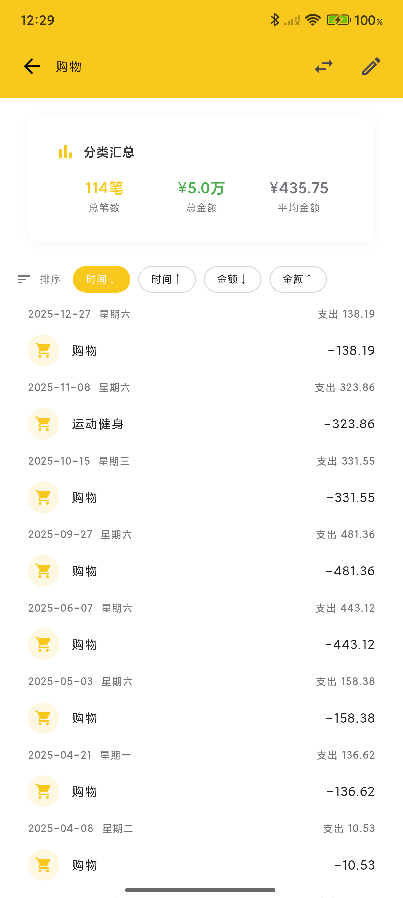
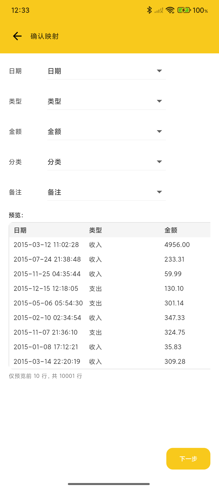

# 蜜蜂记账（BeeCount）

<div align="center">


**你的数据，你做主的开源记账应用**

**核心优势：支持 iCloud/自建 Supabase/WebDAV/S3 协议服务器，数据完全掌控在你手中**

<br/>

<a href="https://apps.apple.com/app/id6754611670">
  
</a>
<a href="https://play.google.com/store/apps/details?id=com.tntlikely.beecount">
  
</a>
<a href="https://testflight.apple.com/join/Eaw2rWxa">
  
</a>
<a href="https://github.com/TNT-Likely/BeeCount/releases/latest">
  
</a>

<br/>
<br/>

[🌐 官网](https://beecount-website.pages.dev) | [📖 使用文档](https://beecount-website.pages.dev/docs/intro) | [💝 捐赠支持](#-捐赠) | [🌐 English](README_EN.md)

</div>

---

> ## 💬 加入微信交流群
>
> 由于微信群已满200人，无法通过自由扫码加入，请添加微信 **"LinYiXiao_Sx"** 邀请入群，备注 **"BeeCount"**。
>
> **加入微信群，获取最新动态、功能建议、问题反馈**

---

> ## 📱 平台支持
>
> 🤖 **Android** - [Google Play](https://play.google.com/store/apps/details?id=com.tntlikely.beecount) | [下载 APK](https://github.com/TNT-Likely/BeeCount/releases/latest) | 支持 Android 5.0+
>
> 🍎 **iOS** - [App Store](https://apps.apple.com/app/id6754611670) | [TestFlight 公测版](https://testflight.apple.com/join/Eaw2rWxa) | 支持 iOS 15.5+
>
> 💡 在 App Store 或 Google Play 搜索 **"蜜蜂记账 - 简洁记账本"** 即可下载
>
> 📱 **HarmonyOS** - 正在上架中 | 支持 HarmonyOS 5.0+ | [鸿蒙版本仓库](https://github.com/TNT-Likely/beecount-openharmony)

---

## 💡 为什么选择蜜蜂记账？

<table>
<tr>
<td width="50%">

### 🔒 传统记账应用的问题

- ❌ 数据存储在第三方服务器
- ❌ 隐私无法保证，可能被分析利用
- ❌ 服务商倒闭数据可能丢失
- ❌ 高级功能需要付费订阅
- ❌ 强制广告和理财产品推荐
- ❌ 闭源软件，无法审计代码

</td>
<td width="50%">

### ✅ 蜜蜂记账的优势

- ✅ **自建服务器**，数据完全自主
- ✅ **开源透明**，代码可审计
- ✅ **离线优先**，无网也能用
- ✅ **个人免费**，无广告无付费墙（包括自动记账等核心功能）
- ✅ **隐私保护**，开发者无法访问你的数据
- ✅ **源代码公开**，代码可审计

</td>
</tr>
</table>

一款轻量、开源、隐私可控的**个人财务管理**和**支出追踪** App，支持 iOS/Android 双平台。内置完整的账本管理、**收支记录**、**OCR 图片识别**、**拍照记账**、**语音记账**、**截图自动记账**、**账户转账**、**二级分类**、分类统计、**图表分析**、数据导入导出功能，并支持 iCloud（iOS）/自建 Supabase/WebDAV/S3 协议（Cloudflare R2/AWS S3/MinIO 等）云服务器同步。支持**多语言**（简繁中文/英文）和**暗黑模式**，适合注重隐私的个人和家庭进行日常**费用记录**和**收支管理**。

## 📱 核心功能展示

<div align="center">
  
  
  
  
</div>

<details>
<summary>📸 查看更多截图</summary>

### 数据管理功能

<div align="center">
  
  
  
  
</div>

### 个性化与管理

<div align="center">
  
  
  
  
</div>

### 数据导入导出

<div align="center">
  
</div>

### 🌙 暗黑模式

<div align="center">
  
  
  
  
</div>

<div align="center">
  
</div>

</details>

## 🌟 核心特性

<details>
<summary><b>查看核心特性</b></summary>

### ☁️ 自建云服务 - 核心差异化优势

> **这是蜜蜂记账最大的特色：数据完全由你掌控！**

| 云同步方案 | 适用场景 | 特点 |
|---------|---------|------|
| **iCloud** | iOS 用户 | 🆕 零配置、原生集成、Apple 生态无缝同步 |
| **Supabase** | 无 NAS 的用户 | 免费额度充足、配置简单、云端托管 |
| **WebDAV** | 有 NAS 的用户 | 数据完全本地化、支持群晖/绿联云/Nextcloud |
| **S3 协议** | 追求灵活性的用户 | 🆕 支持 Cloudflare R2/AWS S3/MinIO，免费额度大 |

**为什么选择自建？**

- 🔐 **隐私第一**：开发者无法访问你的数据
- 💰 **成本可控**：Supabase/Cloudflare R2 免费额度够用，WebDAV 一次性投入
- 🛡️ **数据安全**：不担心服务商倒闭或数据泄露
- 🔓 **开源审计**：所有云同步代码开源，可审计

[📖 查看云服务配置教程](#️-云备份配置可选)

### 🔒 数据安全与隐私

- **离线优先**：基于本地 SQLite，无网也能用
- **开源透明**：源代码公开，代码可审计
- **可选同步**：不配置云服务也能完整使用
- **零追踪**：无统计、无广告、无数据收集

### 📊 完整记账功能

#### 🤖 AI 智能记账

- **🤖 AI 小助手**（New!）
  - **智能对话记账**：自然语言交互，智能理解记账意图
  - **上下文记忆**：记住对话历史，支持连续对话
  - **账单信息提取**：智能识别金额、商家、分类等信息
  - **一键确认记账**：AI 提取信息后，确认即可完成记账
  - 基于智谱 GLM-4 大模型，支持复杂语义理解

- **📸 OCR 图片识别 / 拍照记账**
  - 支持拍照或从相册选择支付截图
  - AI 自动识别金额、商家、分类等账单信息
  - 双引擎支持：本地 TFLite 模型 + GLM 云端模型
  - 准确识别支付宝、微信支付、云闪付等主流支付方式

- **🎤 语音记账**
  - 按住说话，松手即完成记账
  - GLM 语音模型智能理解自然语言
  - 支持口语化表达，如："今天买菜花了50块"
  - 自动识别金额、分类、备注等信息

- **⚡ 截图自动记账**
  - **Android**：无障碍服务自动监听截图，支付后自动记账
  - **iOS**：快捷指令集成，支持双击背部触发
  - 智能识别支付宝、微信支付信息
  - 自动创建账单，实时更新账本数据

#### 📝 基础记账功能

- **手动记账**：收入/支出分类、金额、日期、备注
- **多账本管理**：生活、工作、投资分开管理
- **独立账户管理**：支持现金、银行卡、信用卡等多种账户类型，每个账户独立记录余额
- **账户转账功能**：支持账户间转账记录，自动更新双方账户余额
- **二级分类系统**：支持父子分类层级，更细致的账单归类（可选择一级或二级分类模式）
- **标签管理**（New!）：为交易添加自定义标签，支持多标签、颜色标记，灵活归类和筛选
- **预算管理**（New!）：设置月度总预算和分类预算，实时追踪支出进度，超支提醒
- **周期记账**（New!）：支持每日/每周/每月/每年自动记账，适合固定收支（房租、工资等）
- **图表分析**：月度报表、分类排行、趋势分析
- **数据导入导出**：CSV 格式，兼容主流应用；支持配置导入导出（YAML 格式）
- **桌面小组件**：iOS/Android 桌面小组件，快速查看收支情况

### 🎨 个性化与国际化

- **暗黑模式**：完整的深色主题支持，护眼且 OLED 友好
  - 纯黑背景 + 主题色点缀，极简高级感
  - 所有页面、弹窗、键盘均已适配
  - 跟随系统自动切换或手动设置
- **主题装扮**：多种主题色彩，打造专属风格
- **3 种语言**：简体中文、繁体中文、English
  - 完整界面翻译 + 智能分类映射
  - 本地化日期/数字格式
  - CSV 导入自动识别多语言分类

> 💡 需要添加新语言？欢迎在 [Issues](https://github.com/TNT-Likely/BeeCount/issues) 中提出！

</details>

## ☁️ 云备份配置（可选）

<details>
<summary><b>📖 点击查看详细配置教程</b></summary>

### 为什么选择自建云服务？

- **数据主权**：数据完全存储在你自己控制的服务器或云平台中
- **隐私保护**：开发者无法访问你的任何数据
- **成本可控**：大多数方案都提供免费额度或一次性购买
- **稳定可靠**：不依赖第三方托管服务，自主掌控
- **灵活选择**：根据自己的需求选择最合适的方案

---

### 方案一：iCloud（推荐 iOS 用户）🆕

**适用场景**：iOS 用户，追求零配置、无缝同步体验

**优势**：

- ✅ **零配置**：无需任何设置，开箱即用
- ✅ **原生集成**：使用 Apple ID 自动同步
- ✅ **隐私保护**：数据存储在你的 iCloud Drive 中
- ✅ **多设备同步**：iPhone、iPad 数据自动同步

**使用方式**：

1. 确保 iOS 设备已登录 iCloud 并开启 iCloud Drive
2. 打开蜜蜂记账 → 个人中心 → 云服务
3. 选择 **iCloud**，即可开始同步

> 💡 **提示**：iCloud 同步仅支持 iOS 设备。如果你需要跨平台同步（iOS + Android），请使用 Supabase 或 WebDAV。

---

### 方案二：Supabase（推荐新手）

**适用场景**：适合没有 NAS 设备，想要快速开始的用户

**配置步骤**：

1. **创建 Supabase 项目**
   - 访问 [supabase.com](https://supabase.com) 注册账号
   - 创建新项目，选择合适的区域
   - 在项目设置中获取 URL 和 anon key

2. **配置 Storage**
   - 在 Supabase 控制台创建名为 `beecount-backups` 的 Storage Bucket
   - 设置为 Private（不勾选 Public bucket）
   - **配置 RLS 访问策略**：需要创建 4 条策略，确保用户只能访问自己的数据
     - 进入 bucket 的 Policies 标签页
     - 分别创建以下 4 条策略（每条策略配置相同）：
       - **SELECT**：允许用户读取自己的备份文件
       - **INSERT**：允许用户创建新的备份文件
       - **UPDATE**：允许用户更新自己的备份文件
       - **DELETE**：允许用户删除自己的备份文件
     - 每条策略的配置：
       - **Policy name**: 可自定义（如 `Allow user access to own backups`）
       - **Target roles**: 选择 `authenticated`
       - **Policy definition**: 输入以下表达式

         ```sql
         ((bucket_id = 'beecount-backups'::text) AND ((storage.foldername(name))[1] = 'users'::text) AND ((storage.foldername(name))[2] = (auth.uid())::text))
         ```

       - 此策略确保用户只能访问 `beecount-backups/users/<自己的用户ID>/` 路径下的文件

3. **应用内配置**
   - 打开蜜蜂记账 → 个人中心 → 云服务
   - 点击"添加自定义云服务"
   - 选择服务类型：**Supabase**
   - 填入你的 Supabase URL 和 anon key
   - 保存并启用配置
   - 点击"登录"，注册/登录账号后即可开始同步

### 方案三：WebDAV 服务器（推荐有 NAS 的用户）

**适用场景**：已有 NAS 设备或私有云存储的用户

**支持的服务**：

- ✅ 绿联云 NAS
- ✅ 群晖 Synology NAS
- ✅ Nextcloud
- ✅ 坚果云 WebDAV
- ✅ ownCloud
- ✅ 其他支持 WebDAV 协议的服务器

**配置步骤**：

1. **启用 WebDAV 服务**
   - 在 NAS 或云存储平台启用 WebDAV 功能
   - 记录 WebDAV 服务器地址（如 `http://nas.local:5005`）
   - 创建或使用现有的用户账号

2. **准备存储目录**（可选）
   - 在 WebDAV 根目录下创建 `BeeCount` 文件夹
   - 或使用任意路径（配置时指定即可）

3. **应用内配置**
   - 打开蜜蜂记账 → 个人中心 → 云服务
   - 点击"添加自定义云服务"
   - 选择服务类型：**WebDAV**
   - 填写配置信息：
     - **WebDAV 服务器 URL**：如 `http://nas.local:5005`
     - **用户名**：你的 WebDAV 用户名
     - **密码**：你的 WebDAV 密码
     - **远程路径**：存储路径（如 `/home/BeeCount` 或 `/BeeCount`）
   - 点击"测试连接"验证配置
   - 保存并启用配置
   - WebDAV 无需额外登录，配置后即可直接同步

**常见 WebDAV 配置示例**：

```
绿联云 NAS：
- URL: http://你的NAS地址:5005
- 远程路径: /home/BeeCount

群晖 NAS：
- URL: http://你的NAS地址:5005 或 https://你的域名
- 远程路径: /BeeCount

坚果云：
- URL: https://dav.jianguoyun.com/dav/
- 远程路径: /BeeCount
```

---

### 方案四：S3 协议存储（推荐追求灵活性的用户）🆕

**适用场景**：需要灵活选择云服务商，或想利用免费额度的用户

**支持的服务**：

- ✅ **Cloudflare R2**（推荐，10GB 免费存储）
- ✅ **AWS S3**（全球最流行的对象存储）
- ✅ **MinIO**（开源自建方案）
- ✅ **阿里云 OSS**（兼容 S3 协议）
- ✅ **腾讯云 COS**（兼容 S3 协议）
- ✅ 其他兼容 S3 协议的对象存储服务

**优势**：

- ✅ **免费额度大**：Cloudflare R2 提供 10GB 免费存储
- ✅ **灵活选择**：支持多家云服务商，随时切换
- ✅ **标准协议**：S3 协议是业界标准，兼容性强
- ✅ **性能优异**：CDN 加速，全球访问快速

**配置步骤（以 Cloudflare R2 为例）**：

1. **创建 R2 存储桶**
   - 登录 [Cloudflare Dashboard](https://dash.cloudflare.com/)
   - 进入 **R2** 服务
   - 创建新存储桶（Bucket），如命名为 `beecount-backups`
   - 记录存储桶名称

2. **获取 API 凭证**
   - 在 R2 页面点击 **Manage R2 API Tokens**
   - 创建新的 API Token
   - 权限选择 **Object Read & Write**
   - 记录以下信息：
     - **Access Key ID**（访问密钥）
     - **Secret Access Key**（私密密钥）
     - **Endpoint**（如 `<账户ID>.r2.cloudflarestorage.com`）

3. **应用内配置**
   - 打开蜜蜂记账 → 个人中心 → 云服务
   - 点击"添加自定义云服务"
   - 选择服务类型：**S3 协议存储**
   - 填写配置信息：
     - **端点地址**：Cloudflare R2 endpoint（不含 `https://`）
     - **区域**：`auto`（R2 自动选择区域）
     - **Access Key**：你的 Access Key ID
     - **Secret Key**：你的 Secret Access Key
     - **存储桶名称**：创建的存储桶名称（如 `beecount-backups`）
     - **使用 HTTPS**：开启（推荐）
     - **端口**：留空（使用默认端口）
   - 点击"测试连接"验证配置
   - 保存并启用配置
   - S3 无需额外登录，配置后即可直接同步

**其他 S3 服务配置示例**：

```
Cloudflare R2：
- 端点地址: <账户ID>.r2.cloudflarestorage.com
- 区域: auto
- 使用 HTTPS: 是

AWS S3：
- 端点地址: s3.amazonaws.com
- 区域: us-east-1（根据你的存储桶区域填写）
- 使用 HTTPS: 是

MinIO（自建）：
- 端点地址: minio.example.com
- 区域: us-east-1 或 auto
- 使用 HTTPS: 根据配置选择
- 端口: 9000（或自定义端口）

阿里云 OSS（S3 兼容模式）：
- 端点地址: oss-cn-hangzhou.aliyuncs.com
- 区域: oss-cn-hangzhou
- 使用 HTTPS: 是
```

> 💡 **提示**：
>
> - 端点地址请**不要**包含 `http://` 或 `https://` 前缀
> - Cloudflare R2 免费额度：10GB 存储 + 每月 1000 万次 A 类操作
> - S3 协议支持跨平台同步（iOS + Android）

---

### 后续计划

我们将持续扩展云服务支持，计划添加：

- 📦 Google Drive
- 📦 Dropbox
- 📦 OneDrive
- 📦 更多...

如果你希望优先支持某个云服务，欢迎在 [Issues](https://github.com/TNT-Likely/BeeCount/issues) 中提出需求！

</details>

---

## 🛠️ 开发指南

<details>
<summary><b>查看开发指南</b></summary>

### 技术栈

- **Flutter 3.27+**：跨平台 UI 框架
- **Riverpod**：状态管理解决方案
- **Drift (SQLite)**：本地数据库 ORM
- **Supabase**：云端备份和同步服务

### 快速开始

```bash
# 安装依赖
flutter pub get

# 代码生成
dart run build_runner build --delete-conflicting-outputs

# 运行应用
flutter run --flavor dev

# 构建发布版本
flutter build apk --flavor prod --release
```

</details>

---

## 🤝 贡献指南

<details>
<summary><b>查看贡献方式</b></summary>

我们欢迎所有形式的贡献！

- 🐛 [报告 Bug](https://github.com/TNT-Likely/BeeCount/issues/new)
- 💡 [提出功能建议](https://github.com/TNT-Likely/BeeCount/discussions/new?category=ideas)
- 💻 [贡献代码](docs/contributing/CONTRIBUTING_ZH.md#代码贡献流程)
- 🌍 [贡献翻译](docs/contributing/CONTRIBUTING_ZH.md#翻译贡献)
- 📝 [完善文档](docs/contributing/CONTRIBUTING_ZH.md#文档贡献)
- 🎨 [设计师招募](docs/contributing/CONTRIBUTING_ZH.md#designer-recruitment)

**快速开始**：

1. Fork 本项目
2. 创建特性分支 (`git checkout -b feature/AmazingFeature`)
3. 提交更改 (`git commit -m 'feat: 添加某个功能'`)
4. 推送到分支 (`git push origin feature/AmazingFeature`)
5. 创建 Pull Request

详细规范请参考[完整贡献指南](docs/contributing/CONTRIBUTING_ZH.md)。

</details>

---

## 💬 常见问题

<details>
<summary><b>查看常见问题解答</b></summary>

<br/>

**Q: 不配置云服务能正常使用吗？**
A: 完全可以！应用默认使用本地存储，所有功能都能正常使用。你仍可随时导出 CSV 进行备份。

**Q: 应该选择 iCloud、Supabase、WebDAV 还是 S3？**
A:

- 如果你是 iOS 用户且只在 Apple 设备间同步，推荐使用 **iCloud**（零配置、原生集成）
- 如果你需要跨平台同步（iOS + Android），推荐使用 **Supabase** 或 **S3**（免费、稳定、易配置）
- 如果你有 NAS 设备或私有云，推荐使用 **WebDAV**（数据完全本地化）
- 如果你想要灵活选择云服务商，推荐使用 **S3**（支持 Cloudflare R2/AWS S3/MinIO 等）

**Q: 如何在多设备间同步数据？**
A:

- **iCloud**：iOS 设备登录同一 Apple ID，数据自动同步
- **Supabase**：所有设备配置相同的 URL 和 anon key，登录同一账号
- **WebDAV**：所有设备配置相同的 WebDAV 服务器地址和凭据
- **S3**：所有设备配置相同的 S3 端点、Access Key 和存储桶名称

**Q: 如何确保数据安全？**
A:

- 使用自己的 Supabase 项目、WebDAV 服务器或 S3 存储桶
- 定期导出 CSV 备份到本地
- WebDAV 和 S3 建议使用 HTTPS 加密传输
- S3 的 Access Key 和 Secret Key 请妥善保管

**Q: WebDAV 配置后为什么无法上传？**
A:

- 检查 WebDAV 服务是否启用且端口正确
- 确认用户名和密码正确
- 某些 NAS 的 WebDAV 需要在特定路径下才能写入（如绿联云需要 `/home/` 路径）
- 点击"测试连接"按钮查看详细错误信息

**Q: S3 配置后为什么连接失败？**
A:

- 确认端点地址**不包含** `http://` 或 `https://` 前缀
- 检查 Access Key 和 Secret Key 是否正确
- 确认存储桶名称拼写正确
- 检查存储桶区域是否匹配（AWS S3 需要准确区域，Cloudflare R2 使用 `auto`）
- 点击"测试连接"按钮查看详细错误信息

> 💡 更多问题请访问 [Issues](https://github.com/TNT-Likely/BeeCount/issues) 或 [Discussions](https://github.com/TNT-Likely/BeeCount/discussions)

</details>

---

## 💝 捐赠

### 为什么需要您的支持？

蜜蜂记账是**完全免费开源**的项目，没有任何广告和付费功能。为了保持项目的持续运营，我们需要您的支持。

您的捐赠将直接用于：

- 📱 **续费 Apple 开发者账号** - 保持 iOS TestFlight 公测可用（$99/年）
- 🔧 **维护项目持续开发** - 支持持续开发和维护

### 捐赠方式

#### 🌍 国际用户

- **GitHub Sponsors**: <https://github.com/sponsors/TNT-Likely> （推荐，0% 手续费）
- **Open Collective**: <https://opencollective.com/beecount>
- **PayPal**: <https://paypal.me/sunxiaoyes>

#### 🇨🇳 中国用户

- **爱发电**: <https://afdian.com/a/sunxiaoyes> （支持订阅）

<details>
<summary>点击查看支付宝/微信二维码</summary>

| 支付宝 | 微信支付 |
|:---:|:---:|
|  |  |

</details>

#### 🪙 加密货币

- **USDT (TRC20)**: `TKBV69B2AoU67p3vDhnJUbMJtZ1DxuUF5C`
- **币安**:

<details>
<summary>点击查看二维码</summary>


</details>

### 📊 资金使用透明度

**已完成**：

- ✅ Apple 开发者账号注册（¥688/年）
- ✅ iOS TestFlight 公测上线
- ✅ 轻量云服务器（¥79/年）- 用于办理ICP备案
- ✅ Google Play 开发者账号注册（¥177，一次性）

**持续成本**：

- 📱 Apple 开发者账号续费：¥688/年
- ☁️ 轻量云服务器：¥79/年

**总计年度成本**：¥767/年（+ 已投入一次性成本 ¥177）

所有捐赠资金的使用情况都会在这里公开透明地说明。

### 🌟 感谢支持者

感谢以下朋友的慷慨支持（按时间排序）：

> 💡 已捐赠？[点击这里提交您的信息](https://github.com/TNT-Likely/BeeCount/issues/new?template=donation_info.yml)，展示在支持者列表中！

| | | | | | | | | | |
|:---:|:---:|:---:|:---:|:---:|:---:|:---:|:---:|:---:|:---:|
|  |  | <a href="https://github.com/fishdivinity"></a> |  |  |  |  |  | <a href="https://github.com/birdnofoots"></a> | <a href="https://github.com/charieswang72-pro"></a> |
| *桥 ¥12 | *睿 ¥720 | [fishdivinity](https://github.com/fishdivinity) ¥100 | *邵 ¥15 | *哥 ¥6 | *特 ¥15 | *文 ¥50 | 匿名者 ¥50 | [birdnofoots](https://github.com/birdnofoots) ¥10 | [Charies](https://github.com/charieswang72-pro) ¥10 |

---

## 📄 开源协议

<details>
<summary><b>查看许可证详情</b></summary>

本项目采用 **商业源代码许可证（Business Source License）**：

- ✅ **个人使用** - 完全免费
- ✅ **学习研究** - 完全免费
- ✅ **开源贡献** - 欢迎参与
- ❌ **商业使用** - 需要付费授权

### 什么是商业使用？

以下情况需要获得商业许可：

- 将本软件作为商业产品或服务提供给客户
- 在盈利性组织中使用本软件
- 基于本软件开发商业产品
- 提供基于本软件的付费云服务

如需商业使用，请通过 [GitHub Issues](https://github.com/TNT-Likely/BeeCount/issues) 联系。

详见 [LICENSE](LICENSE) 文件。

</details>

---

## 📦 相关仓库

| 仓库 | 说明 |
|------|------|
| [BeeCount-Website](https://github.com/TNT-Likely/BeeCount-Website) | 官网/文档仓库 |
| [beecount-openharmony](https://github.com/TNT-Likely/beecount-openharmony) | 鸿蒙版本仓库 |
| [BeeShot](https://github.com/TNT-Likely/BeeShot) | App Store 截图生成器 |

---

## 🙏 致谢

感谢 [果核剥壳 - 互联网的净土](https://www.ghxi.com/)、[星之墨辰](https://mp.weixin.qq.com/s/HieVbKzpdUvnoaCa_9xjkA) 对本项目的宣传

感谢所有为蜜蜂记账项目贡献代码、提出建议和反馈问题的朋友们！

如有问题或建议，欢迎在 [Issues](https://github.com/TNT-Likely/BeeCount/issues) 中提出，或在 [Discussions](https://github.com/TNT-Likely/BeeCount/discussions) 中参与讨论。

**蜜蜂记账 🐝 - 让记账变得简单而安全**
