# BeeCount

<div align="center">


**Your Data, Your Control - Open Source Accounting App**

**Core Advantage: iCloud/Supabase/WebDAV/S3 protocol servers - Your data, Your control**

<br/>

<a href="https://apps.apple.com/app/id6754611670">
  
</a>
<a href="https://play.google.com/store/apps/details?id=com.tntlikely.beecount">
  
</a>
<a href="https://testflight.apple.com/join/Eaw2rWxa">
  
</a>
<a href="https://github.com/TNT-Likely/BeeCount/releases/latest">
  
</a>

<br/>
<br/>

[🌐 Website](https://beecount-website.pages.dev/en/) | [📖 Documentation](https://beecount-website.pages.dev/en/docs/intro) | [💝 Donate](#-donate) | [🇨🇳 中文](README.md)

</div>

---

> ## 📱 Platform Support
>
> 🤖 **Android** - [Google Play](https://play.google.com/store/apps/details?id=com.tntlikely.beecount) | [Download APK](https://github.com/TNT-Likely/BeeCount/releases/latest) | Supports Android 5.0+
>
> 🍎 **iOS** - [App Store](https://apps.apple.com/app/id6754611670) | [TestFlight Beta](https://testflight.apple.com/join/Eaw2rWxa) | Supports iOS 15.5+
>
> 💡 Search for **"BeeCount - Simple Ledger"** on App Store or Google Play to download
>
> 📱 **HarmonyOS** - Coming Soon | Supports HarmonyOS 5.0+ | [HarmonyOS Repository](https://github.com/TNT-Likely/beecount-openharmony)

---

## 💡 Why Choose BeeCount?

<table>
<tr>
<td width="50%">

### 🔒 Problems with Traditional Apps

- ❌ Data stored on third-party servers
- ❌ Privacy risks, data may be analyzed
- ❌ Data loss if service shuts down
- ❌ Premium features behind paywalls
- ❌ Forced ads and loan recommendations
- ❌ Closed-source, cannot audit code

</td>
<td width="50%">

### ✅ BeeCount Advantages

- ✅ **Self-hosted**, complete data control
- ✅ **Open source**, auditable code
- ✅ **Offline-first**, works without network
- ✅ **Free for personal use**, no ads or paywalls (including core features like auto-billing)
- ✅ **Privacy-first**, developers cannot access your data
- ✅ **Open source code**, auditable codebase

</td>
</tr>
</table>

A lightweight, open-source, privacy-focused **personal finance management** and **expense tracker** app for iOS/Android. Features complete ledger management, **income and expense tracking**, **OCR image recognition**, **photo billing**, **voice billing**, **screenshot auto-billing**, **account transfers**, **hierarchical categories**, category statistics, **chart analysis**, data import/export, and iCloud (iOS)/Supabase/WebDAV/S3 protocol (Cloudflare R2/AWS S3/MinIO) cloud sync. Supports **multiple languages** (Simplified/Traditional Chinese, English) and **dark mode**. Perfect for privacy-conscious individuals and families to manage daily **spending** and **budget tracking**.

## 📱 Core Features Showcase

<div align="center">
  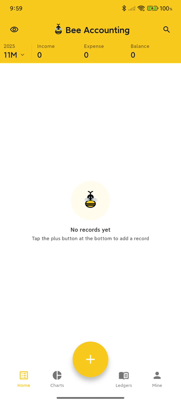
  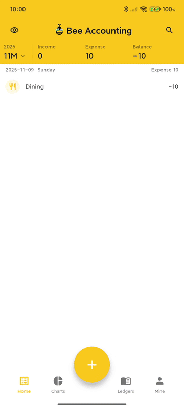
  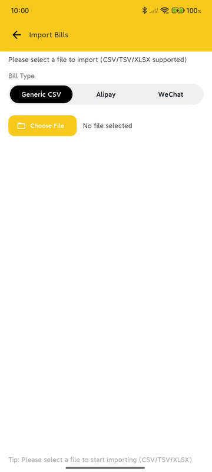
  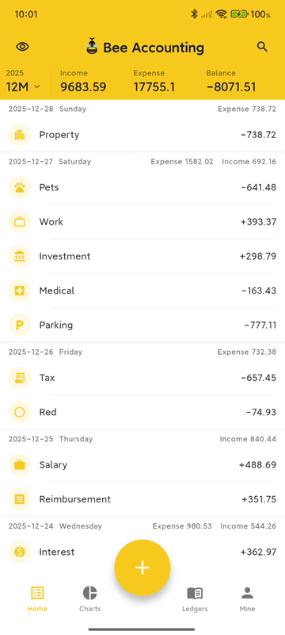
</div>

<details>
<summary>📸 View More Screenshots</summary>

### Data Management

<div align="center">
  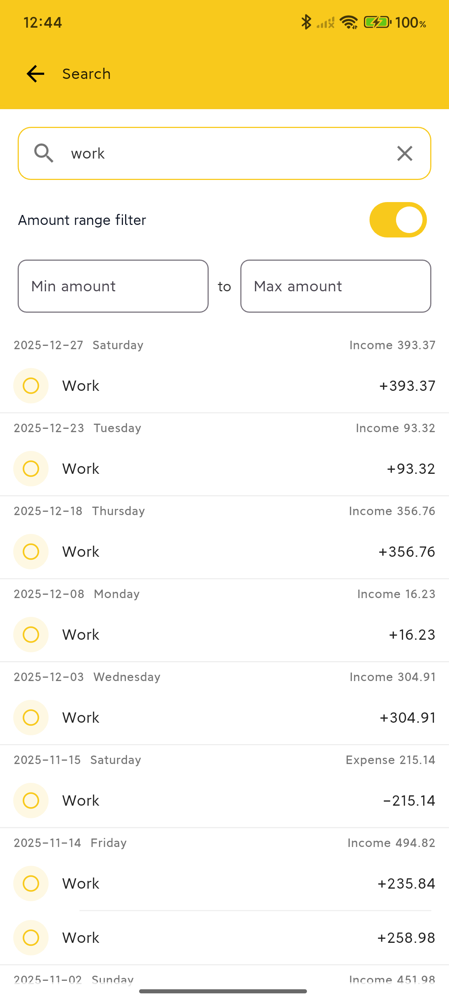
  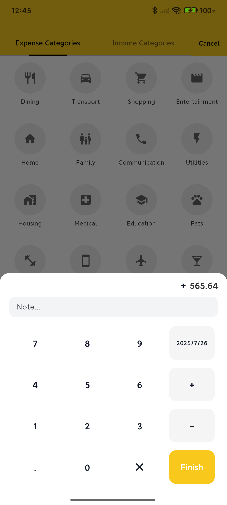
  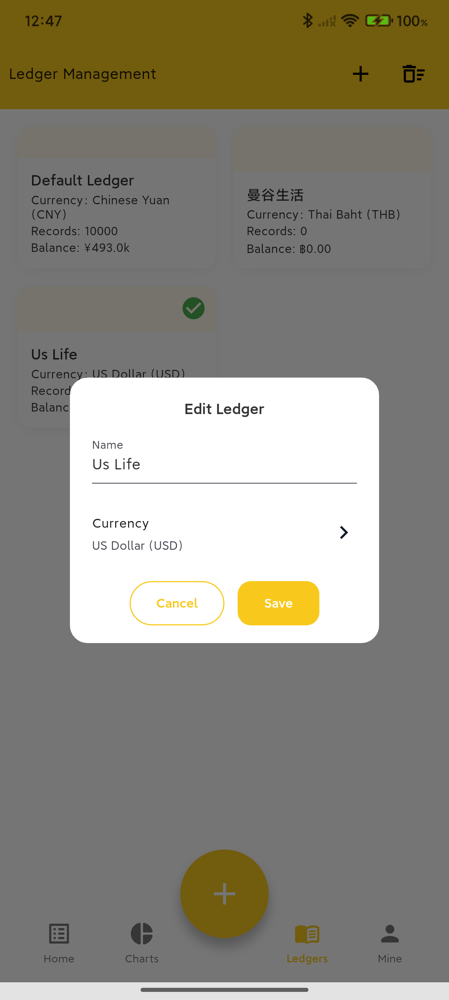
  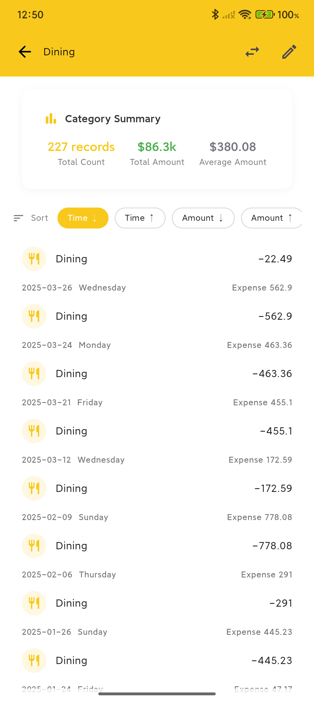
</div>

### Personalization & Management

<div align="center">
  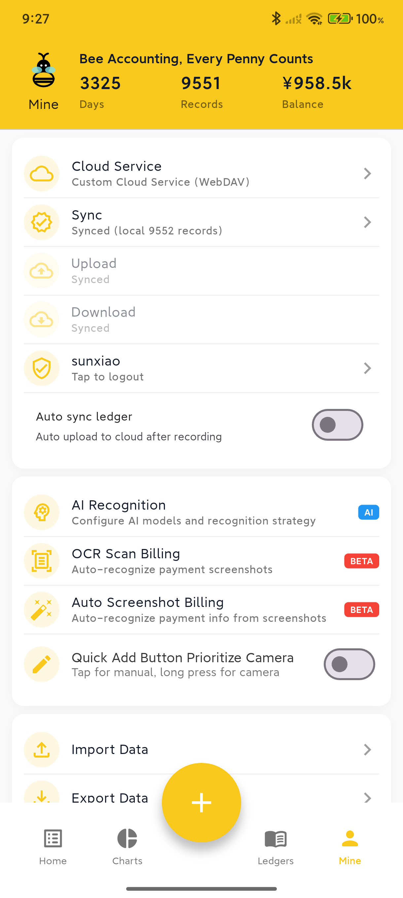
  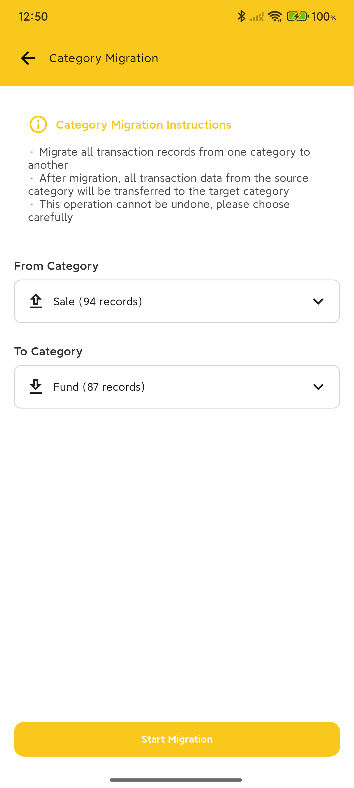
  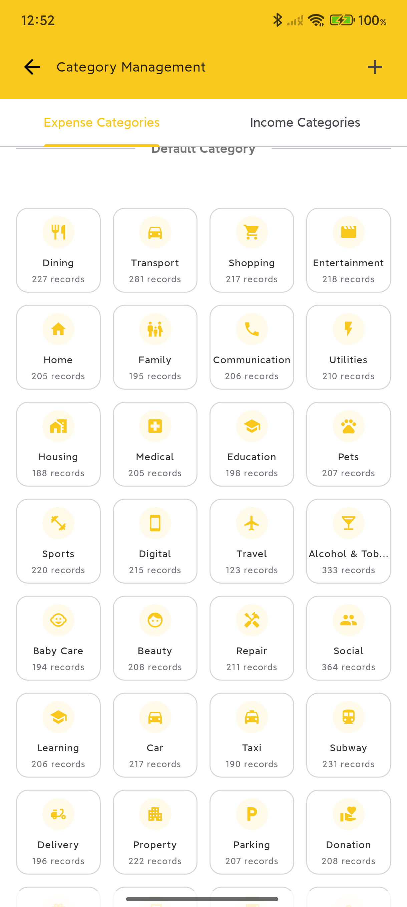
  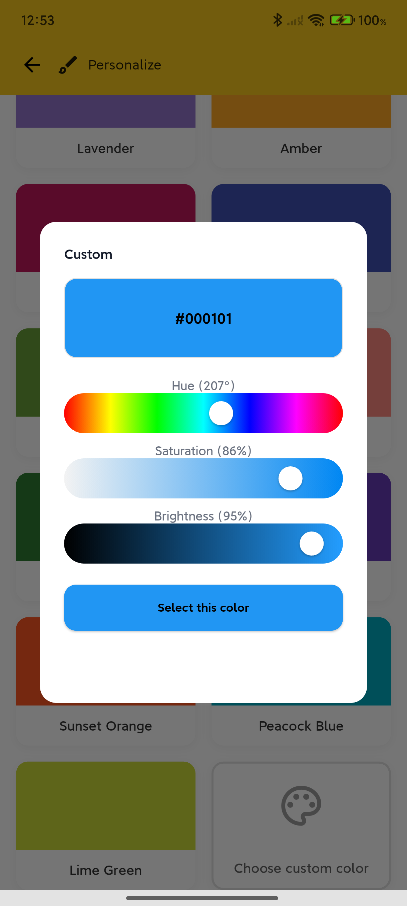
</div>

### Data Import & Export

<div align="center">
  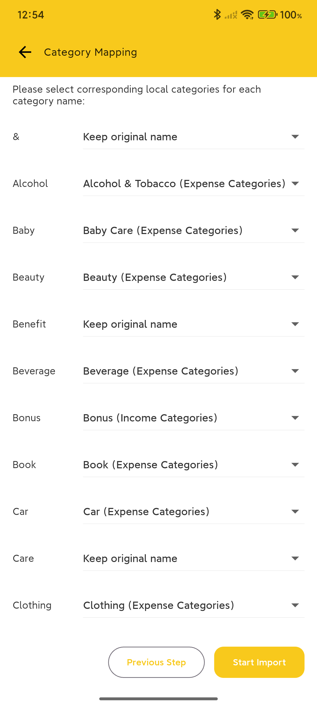
</div>

### 🌙 Dark Mode

<div align="center">
  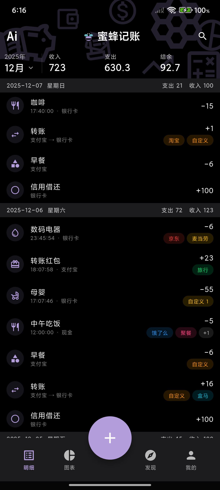
  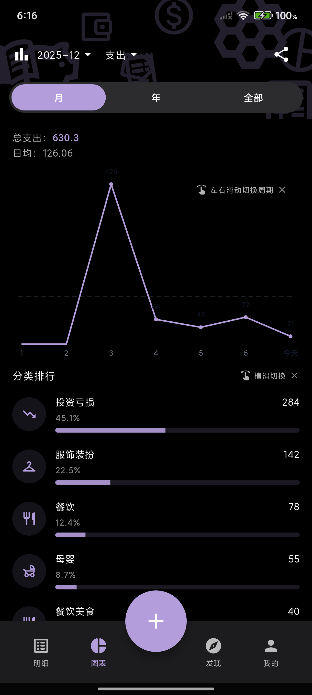
  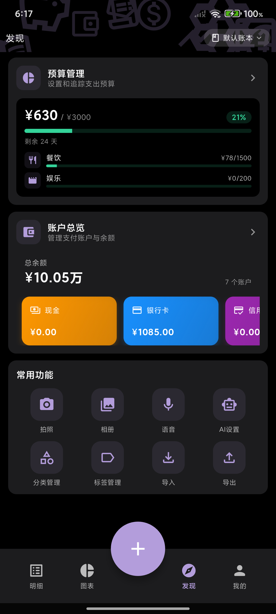
  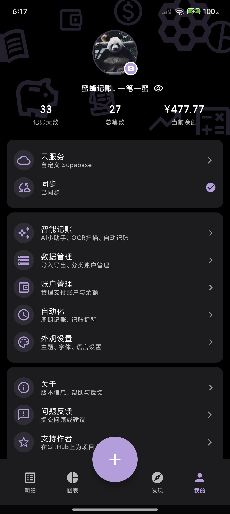
</div>

<div align="center">
  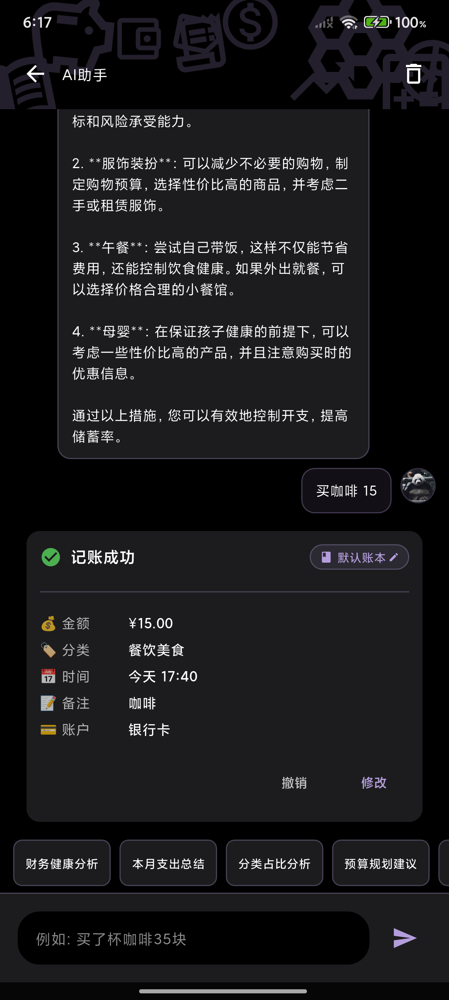
</div>

</details>

## 🌟 Key Features

<details>
<summary><b>View Key Features</b></summary>

### ☁️ Self-Hosted Cloud Service - Core Differentiator

> **This is BeeCount's biggest feature: Complete control over your data!**

| Solution | Best For | Features |
|----------|----------|----------|
| **iCloud** | iOS Users | 🆕 Zero config, native integration, seamless Apple ecosystem sync |
| **Supabase** | Users without NAS | Free tier sufficient, easy setup, cloud-hosted |
| **WebDAV** | Users with NAS | Fully localized data, supports Synology/UGREEN/Nextcloud |
| **S3 Protocol** | Flexibility seekers | 🆕 Supports Cloudflare R2/AWS S3/MinIO, generous free tier |

**Why Self-Hosted?**

- 🔐 **Privacy First**: Developers cannot access your data
- 💰 **Cost Effective**: Supabase free tier sufficient, WebDAV one-time investment
- 🛡️ **Data Security**: No worries about service shutdowns or data breaches
- 🔓 **Open Source**: All cloud sync code is open source and auditable

[📖 View Cloud Service Setup Guide](#️-cloud-backup-configuration-optional)

### 🔒 Data Security & Privacy

- **Offline First**: Based on local SQLite, works without network
- **Open & Transparent**: Open source code, auditable
- **Optional Sync**: Works completely without cloud configuration
- **Zero Tracking**: No analytics, no ads, no data collection

### 📊 Complete Accounting Features

#### 🤖 AI Smart Billing

- **🤖 AI Assistant** (New!)
  - **Intelligent Conversational Billing**: Natural language interaction with smart intent understanding
  - **Contextual Memory**: Remembers conversation history for continuous dialogue
  - **Bill Information Extraction**: Intelligently identifies amount, merchant, category and more
  - **One-Click Confirmation**: Confirm and complete billing after AI extraction
  - Powered by Zhipu GLM-4 large model for complex semantic understanding

- **📸 OCR Image Recognition / Photo Billing**
  - Support camera or album to select payment screenshots
  - AI auto-extracts amount, merchant, category and bill info
  - Dual-engine support: Local TFLite model + GLM cloud model
  - Accurately recognizes Alipay, WeChat Pay, UnionPay and other mainstream payment methods

- **🎤 Voice Billing**
  - Press and hold to speak, release to complete billing
  - GLM voice model intelligently understands natural language
  - Support colloquial expressions like: "Spent 50 on groceries today"
  - Auto-recognizes amount, category, notes and more

- **⚡ Screenshot Auto-Billing**
  - **Android**: Accessibility service auto-monitors screenshots, auto-bills after payment
  - **iOS**: Shortcuts integration, support double-tap back trigger
  - Smart recognition of Alipay and WeChat Pay info
  - Auto-create bills, real-time ledger updates

#### 📝 Basic Billing Features

- **Manual Billing**: Income/expense categories, amounts, dates, notes
- **Multi-Ledger Management**: Separate management for personal, work, investment
- **Independent Account Management**: Support for cash, bank cards, credit cards and other account types, each account tracks balance independently
- **Account Transfer Feature**: Support inter-account transfer records, auto-update balances for both accounts
- **Hierarchical Category System**: Support parent-child category levels for more detailed transaction classification (choose between flat or hierarchical mode)
- **Tag Management** (New!): Add custom tags to transactions, support multiple tags, color markers, flexible categorization and filtering
- **Budget Management** (New!): Set monthly total and category budgets, real-time spending progress tracking, overspend alerts
- **Recurring Transactions** (New!): Support daily/weekly/monthly/yearly automatic recording, suitable for fixed income/expenses (rent, salary, etc.)
- **Chart Analysis**: Monthly reports, category rankings, trend analysis
- **Data Import/Export**: CSV format, compatible with mainstream apps
- **Home Screen Widgets**: iOS/Android widgets for quick overview of income and expenses

### 🎨 Personalization & Internationalization

- **Dark Mode**: Complete dark theme support, eye-friendly and OLED-optimized
  - Pure black background + theme color accents for minimalist aesthetics
  - All pages, dialogs, and keyboards fully adapted
  - Auto-switch with system or manual setting
- **Theme Customization**: Multiple theme colors for personalized style
- **3 Languages**: Simplified Chinese, Traditional Chinese, English
  - Complete UI translation + smart category mapping
  - Localized date/number formats
  - CSV import auto-recognizes multi-language categories

> 💡 Want to add a new language? Welcome to create an [Issue](https://github.com/TNT-Likely/BeeCount/issues)!

</details>

## ☁️ Cloud Backup Configuration (Optional)

<details>
<summary><b>📖 Click to view detailed configuration guide</b></summary>

### Why Choose Self-Hosted Cloud Service?

- **Data Sovereignty**: Data completely stored in servers or cloud platforms you control
- **Privacy Protection**: Developers cannot access any of your data
- **Cost Control**: Most solutions offer free tiers or one-time purchase options
- **Stable & Reliable**: No dependency on third-party hosting services, full control
- **Flexible Choice**: Choose the most suitable solution based on your needs

---

### Option 1: iCloud (Recommended for iOS Users) 🆕

**Use Case**: iOS users seeking zero-configuration, seamless sync experience

**Advantages**:

- ✅ **Zero Configuration**: Works out of the box, no setup required
- ✅ **Native Integration**: Auto-sync using your Apple ID
- ✅ **Privacy Protection**: Data stored in your own iCloud Drive
- ✅ **Multi-Device Sync**: Automatic sync across iPhone and iPad

**How to Use**:

1. Ensure your iOS device is signed into iCloud with iCloud Drive enabled
2. Open BeeCount → Profile → Cloud Service
3. Select **iCloud** and start syncing

> 💡 **Note**: iCloud sync only supports iOS devices. For cross-platform sync (iOS + Android), please use Supabase or WebDAV.

### Option 2: Supabase (Recommended for Beginners)

**Use Case**: Suitable for users without NAS devices who want to get started quickly

**Configuration Steps**:

1. **Create Supabase Project**
   - Visit [supabase.com](https://supabase.com) to register an account
   - Create a new project, select appropriate region
   - Get URL and anon key from project settings

2. **Configure Storage**
   - Create a Storage Bucket named `beecount-backups` in Supabase console
   - Set as Private (uncheck Public bucket)
   - **Configure RLS Access Policies**: Create 4 policies to ensure users can only access their own data
     - Go to the bucket's Policies tab
     - Create the following 4 policies (each with the same configuration):
       - **SELECT**: Allow users to read their own backup files
       - **INSERT**: Allow users to create new backup files
       - **UPDATE**: Allow users to update their own backup files
       - **DELETE**: Allow users to delete their own backup files
     - Configuration for each policy:
       - **Policy name**: Customizable (e.g., `Allow user access to own backups`)
       - **Target roles**: Select `authenticated`
       - **Policy definition**: Enter the following expression

         ```sql
         ((bucket_id = 'beecount-backups'::text) AND ((storage.foldername(name))[1] = 'users'::text) AND ((storage.foldername(name))[2] = (auth.uid())::text))
         ```

       - This policy ensures users can only access files under `beecount-backups/users/<their-user-id>/` path

3. **App Configuration**
   - Open BeeCount → Profile → Cloud Service
   - Tap "Add Custom Cloud Service"
   - Select service type: **Supabase**
   - Enter your Supabase URL and anon key
   - Save and enable configuration
   - Tap "Login", register/sign in and start syncing

### Option 3: WebDAV Server (Recommended for NAS Users)

**Use Case**: For users with NAS devices or private cloud storage

**Supported Services**:

- ✅ UGREEN Cloud NAS
- ✅ Synology NAS
- ✅ Nextcloud
- ✅ Nutstore WebDAV
- ✅ ownCloud
- ✅ Any server supporting WebDAV protocol

**Configuration Steps**:

1. **Enable WebDAV Service**
   - Enable WebDAV functionality on your NAS or cloud storage platform
   - Note the WebDAV server address (e.g., `http://nas.local:5005`)
   - Create or use existing user account

2. **Prepare Storage Directory** (Optional)
   - Create a `BeeCount` folder in WebDAV root directory
   - Or use any path (specify during configuration)

3. **App Configuration**
   - Open BeeCount → Profile → Cloud Service
   - Tap "Add Custom Cloud Service"
   - Select service type: **WebDAV**
   - Fill in configuration:
     - **WebDAV Server URL**: e.g., `http://nas.local:5005`
     - **Username**: Your WebDAV username
     - **Password**: Your WebDAV password
     - **Remote Path**: Storage path (e.g., `/home/BeeCount` or `/BeeCount`)
   - Tap "Test Connection" to verify configuration
   - Save and enable configuration
   - WebDAV requires no additional login, can sync directly after configuration

**Common WebDAV Configuration Examples**:

```
UGREEN Cloud NAS:
- URL: http://your-nas-address:5005
- Remote Path: /home/BeeCount

Synology NAS:
- URL: http://your-nas-address:5005 or https://your-domain
- Remote Path: /BeeCount

Nutstore:
- URL: https://dav.jianguoyun.com/dav/
- Remote Path: /BeeCount
```

---

### Option 4: S3 Protocol Storage (Recommended for Flexibility Seekers) 🆕

**Use Case**: Users who need flexible cloud provider choice or want to leverage generous free tiers

**Supported Services**:

- ✅ **Cloudflare R2** (Recommended, 10GB free storage)
- ✅ **AWS S3** (World's most popular object storage)
- ✅ **MinIO** (Open-source self-hosted solution)
- ✅ **Alibaba Cloud OSS** (S3 protocol compatible)
- ✅ **Tencent Cloud COS** (S3 protocol compatible)
- ✅ Other S3 protocol-compatible object storage services

**Advantages**:

- ✅ **Generous Free Tier**: Cloudflare R2 offers 10GB free storage
- ✅ **Flexible Choice**: Support for multiple cloud providers, easy to switch
- ✅ **Standard Protocol**: S3 is an industry-standard protocol with excellent compatibility
- ✅ **Excellent Performance**: CDN acceleration, fast global access

**Configuration Steps (Using Cloudflare R2 as Example)**:

1. **Create R2 Bucket**
   - Log in to [Cloudflare Dashboard](https://dash.cloudflare.com/)
   - Go to **R2** service
   - Create a new bucket, e.g., named `beecount-backups`
   - Record the bucket name

2. **Get API Credentials**
   - On the R2 page, click **Manage R2 API Tokens**
   - Create a new API Token
   - Select **Object Read & Write** permissions
   - Record the following information:
     - **Access Key ID** (access key)
     - **Secret Access Key** (secret key)
     - **Endpoint** (e.g., `<account-id>.r2.cloudflarestorage.com`)

3. **In-App Configuration**
   - Open BeeCount → Profile → Cloud Service
   - Click "Add Custom Cloud Service"
   - Select service type: **S3 Protocol Storage**
   - Fill in configuration:
     - **Endpoint**: Cloudflare R2 endpoint (without `https://` prefix)
     - **Region**: `auto` (R2 auto-selects region)
     - **Access Key**: Your Access Key ID
     - **Secret Key**: Your Secret Access Key
     - **Bucket Name**: Created bucket name (e.g., `beecount-backups`)
     - **Use HTTPS**: Enable (recommended)
     - **Port**: Leave empty (use default port)
   - Click "Test Connection" to verify configuration
   - Save and enable configuration
   - S3 requires no additional login, can sync directly after configuration

**Other S3 Service Configuration Examples**:

```
Cloudflare R2:
- Endpoint: <account-id>.r2.cloudflarestorage.com
- Region: auto
- Use HTTPS: Yes

AWS S3:
- Endpoint: s3.amazonaws.com
- Region: us-east-1 (fill in according to your bucket region)
- Use HTTPS: Yes

MinIO (Self-hosted):
- Endpoint: minio.example.com
- Region: us-east-1 or auto
- Use HTTPS: Based on your configuration
- Port: 9000 (or custom port)

Alibaba Cloud OSS (S3 Compatible Mode):
- Endpoint: oss-cn-hangzhou.aliyuncs.com
- Region: oss-cn-hangzhou
- Use HTTPS: Yes
```

> 💡 **Tips**:
>
> - Endpoint address should **NOT** include `http://` or `https://` prefix
> - Cloudflare R2 free tier: 10GB storage + 10M Class A operations per month
> - S3 protocol supports cross-platform sync (iOS + Android)

---

### Future Plans

We will continue expanding cloud service support, planning to add:

- 📦 Google Drive
- 📦 Dropbox
- 📦 OneDrive
- 📦 More...

If you'd like to prioritize support for a specific cloud service, welcome to create a feature request in [Issues](https://github.com/TNT-Likely/BeeCount/issues)!

</details>

---

## 🛠️ Development Guide

<details>
<summary><b>View development guide</b></summary>

### Tech Stack

- **Flutter 3.27+**: Cross-platform UI framework
- **Riverpod**: State management solution
- **Drift (SQLite)**: Local database ORM
- **Supabase**: Cloud backup and sync service

### Quick Start

```bash
# Install dependencies
flutter pub get

# Code generation
dart run build_runner build --delete-conflicting-outputs

# Run app
flutter run --flavor dev

# Build release version
flutter build apk --flavor prod --release
```

</details>

---

## 🤝 Contributing

<details>
<summary><b>View contribution guidelines</b></summary>

We welcome all forms of contributions!

- 🐛 [Report Bugs](https://github.com/TNT-Likely/BeeCount/issues/new)
- 💡 [Suggest Features](https://github.com/TNT-Likely/BeeCount/discussions/new?category=ideas)
- 💻 [Contribute Code](docs/contributing/CONTRIBUTING_EN.md#code-contribution-workflow)
- 🌍 [Contribute Translations](docs/contributing/CONTRIBUTING_EN.md#translation-contributions)
- 📝 [Improve Documentation](docs/contributing/CONTRIBUTING_EN.md#documentation-contributions)
- 🎨 [Designer Recruitment](docs/contributing/CONTRIBUTING_EN.md#designer-recruitment)

**Quick Start**:

1. Fork this project
2. Create feature branch (`git checkout -b feature/AmazingFeature`)
3. Commit changes (`git commit -m 'feat: add some feature'`)
4. Push to branch (`git push origin feature/AmazingFeature`)
5. Create Pull Request

For detailed standards, please refer to the [Complete Contributing Guide](docs/contributing/CONTRIBUTING_EN.md).

</details>

---

## 💬 FAQ

<details>
<summary><b>View frequently asked questions</b></summary>

<br/>

**Q: Can I use it normally without configuring cloud services?**
A: Absolutely! The app uses local storage by default, and all features work normally. You can still export CSV backups at any time.

**Q: Should I choose iCloud, Supabase, WebDAV or S3?**
A:

- If you're an iOS user and only sync between Apple devices, we recommend **iCloud** (zero config, native integration)
- If you need cross-platform sync (iOS + Android), we recommend **Supabase** or **S3** (free, stable, easy to configure)
- If you have a NAS device or private cloud, we recommend **WebDAV** (fully localized data)
- If you want flexible cloud provider choice, we recommend **S3** (supports Cloudflare R2/AWS S3/MinIO)
- All options support complete sync functionality, choose based on your needs

**Q: Why can't I upload after configuring WebDAV?**
A:

- Check if WebDAV service is enabled and port is correct
- Verify username and password are correct
- Some NAS WebDAV requires specific paths for write access (e.g., UGREEN Cloud requires `/home/` path)
- Click "Test Connection" button to view detailed error messages

**Q: Why does S3 connection fail?**
A:

- Ensure endpoint address does **NOT** include `http://` or `https://` prefix
- Verify Access Key and Secret Key are correct
- Confirm bucket name spelling is correct
- Check bucket region matches (AWS S3 requires accurate region, Cloudflare R2 uses `auto`)
- Click "Test Connection" button to view detailed error messages

**Q: Can I switch back to default mode after configuring custom cloud service?**
A: Yes, you can switch anytime. The saved custom configuration won't be lost and can be re-enabled.

**Q: How to ensure data security?**
A:

- Use your own Supabase project, WebDAV server or S3 bucket
- Regularly export CSV backups to local storage
- Use strong passwords and enable two-factor authentication (if supported)
- For WebDAV and S3, recommend using HTTPS for encrypted transmission
- Keep your S3 Access Key and Secret Key secure

**Q: What data formats are supported?**
A: Currently supports CSV format for import/export, compatible with data formats from most mainstream accounting apps.

**Q: How to sync data across multiple devices?**
A:

- **iCloud**: Simply sign in with the same Apple ID on iOS devices, data syncs automatically
- **Supabase**: Configure same URL and anon key on all devices, log in with same account
- **WebDAV**: Configure same WebDAV server address and credentials on all devices
- **S3**: Configure same S3 endpoint, Access Key and bucket name on all devices

> 💡 More questions? Visit [Issues](https://github.com/TNT-Likely/BeeCount/issues) or [Discussions](https://github.com/TNT-Likely/BeeCount/discussions)

</details>

---

## 💝 Donate

### Why We Need Your Support?

BeeCount is a **completely free and open-source** project with no ads or paid features. However, to make it available for iOS users, we need an **Apple Developer Account** ($99/year) to sign the app.

Your donation will be used for:

- 📱 **Renew Apple Developer Account** - Keep iOS TestFlight beta accessible ($99/year)
- 🔧 **Support continuous development and maintenance** - Keep the project actively developed

### Donation Methods

#### 🌍 International

- **GitHub Sponsors**: <https://github.com/sponsors/TNT-Likely> (Recommended, 0% fee)
- **Open Collective**: <https://opencollective.com/beecount>
- **PayPal**: <https://paypal.me/sunxiaoyes>

#### 🇨🇳 China

- **Afdian (爱发电)**: <https://afdian.com/a/sunxiaoyes> (Subscription supported)

<details>
<summary>Click to view Alipay/WeChat QR codes</summary>

| Alipay | WeChat Pay |
|:---:|:---:|
|  |  |

</details>

#### 🪙 Cryptocurrency

- **USDT (TRC20)**: `TKBV69B2AoU67p3vDhnJUbMJtZ1DxuUF5C`
- **Binance**:

<details>
<summary>Click to view QR code</summary>


</details>

### 📊 Funding Progress

- 🎯 **Goal**: $99 (Apple Developer Account annual fee)
- 💰 **Raised**: ¥732 (≈ $101)
- 📈 **Progress**: 101.67% ✅

```
Progress: [██████████] 101.67% - 🎉 Goal Achieved!
```

**Completed**:

- ✅ Apple Developer Account registration (¥688/year, ≈$95/year)
- ✅ iOS TestFlight public beta launched
- ✅ Lightweight cloud server (¥79/year, ≈$11/year) - For ICP filing
- ✅ Google Play Developer Account registration (¥177, ≈$25, one-time)

**Ongoing Costs**:

- 📱 Apple Developer Account renewal: ¥688/year (≈$95/year)
- ☁️ Lightweight cloud server: ¥79/year (≈$11/year)

**Total Annual Cost**: ¥767/year (≈$106/year) (+ one-time cost ¥177/≈$25)

All donation fund usage will be transparently disclosed here.

### 🌟 Special Thanks to Our Supporters

Thank you to the following generous supporters (in chronological order):

> 💡 Already donated? [Click here to submit your info](https://github.com/TNT-Likely/BeeCount/issues/new?template=donation_info.yml) to be featured in the supporters list!

| | | | | | | | | | |
|:---:|:---:|:---:|:---:|:---:|:---:|:---:|:---:|:---:|:---:|
|  |  | <a href="https://github.com/fishdivinity"></a> |  |  |  |  |  | <a href="https://github.com/birdnofoots"></a> | <a href="https://github.com/charieswang72-pro"></a> |
| *Qiao ¥12 | *Rui ¥720 | [fishdivinity](https://github.com/fishdivinity) ¥100 | *Shao ¥15 | *Ge ¥6 | *Te ¥15 | *Wen ¥50 | Anonymous ¥50 | [birdnofoots](https://github.com/birdnofoots) ¥10 | [Charies](https://github.com/charieswang72-pro) ¥10 |

---

## 📄 Open Source License

<details>
<summary><b>View license details</b></summary>

This project is licensed under the **Business Source License**:

- ✅ **Personal Use** - Completely Free
- ✅ **Learning & Research** - Completely Free
- ✅ **Open Source Contribution** - Welcome
- ❌ **Commercial Use** - Paid License Required

### What is Commercial Use?

Commercial license is required for:

- Providing this software as part of commercial products or services
- Using this software in for-profit organizations
- Developing commercial products based on this software
- Providing paid cloud services based on this software

For commercial use, please contact us via [GitHub Issues](https://github.com/TNT-Likely/BeeCount/issues).

See [LICENSE](LICENSE) for details.

</details>

---

## 📦 Related Repositories

| Repository | Description |
|------------|-------------|
| [BeeCount-Website](https://github.com/TNT-Likely/BeeCount-Website) | Website & Documentation |
| [beecount-openharmony](https://github.com/TNT-Likely/beecount-openharmony) | HarmonyOS Version |
| [BeeShot](https://github.com/TNT-Likely/BeeShot) | App Store Screenshot Generator |

---

## 🙏 Acknowledgments

Thanks to all friends who have contributed code, suggestions, and feedback to the BeeCount project!

If you have questions or suggestions, feel free to raise them in [Issues](https://github.com/TNT-Likely/BeeCount/issues) or participate in discussions at [Discussions](https://github.com/TNT-Likely/BeeCount/discussions).

**BeeCount 🐝 - Making Accounting Simple and Secure**
